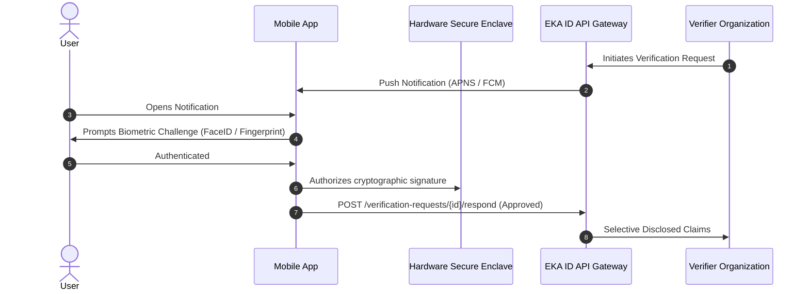

# EKA ID Mobile Architecture & Specifications

## Overview
The EKA ID Mobile Application provides a native iOS and Android experience designed for:
1. **Offline-Capable Digital Identity Wallet**: Secure enclave / KeyStore backed storage of verifiable credentials.
2. **Camera-Based QR Scanner**: Hardware accelerated scanning of EKA dynamic QR tokens.
3. **Biometric Authentication**: Face ID / Fingerprint protection prior to generating ephemeral verification QR tokens or approving consent requests.
4. **Push Notification Consent**: Interactive OS notifications for immediate Approve/Deny response to organization verification requests.

---

## Technology Stack
- **Framework**: React Native with Expo (SDK 51+) or Flutter 3.x
- **Secure Storage**: `expo-secure-store` / Android Keystore / iOS Keychain
- **Biometrics**: `expo-local-authentication` (TouchID / FaceID)
- **Camera Scanner**: `expo-camera` / ML Kit Barcode Scanning
- **Crypto Engine**: `react-native-quick-crypto` for offline Ed25519 signature checks
- **State Management**: Zustand + React Query

---

## Security Model

---

## Offline Verification Mode (V2 Specification)
1. The mobile app periodically refreshes a signed Attestation Package from the EKA Identity Provider when online.
2. When scanning in low-connectivity environments (e.g. airport checkpoints, industrial gates):
   - The scanner validates the signature using the pre-cached EKA Root Public Key.
   - The credential expires within 24 hours of generation.